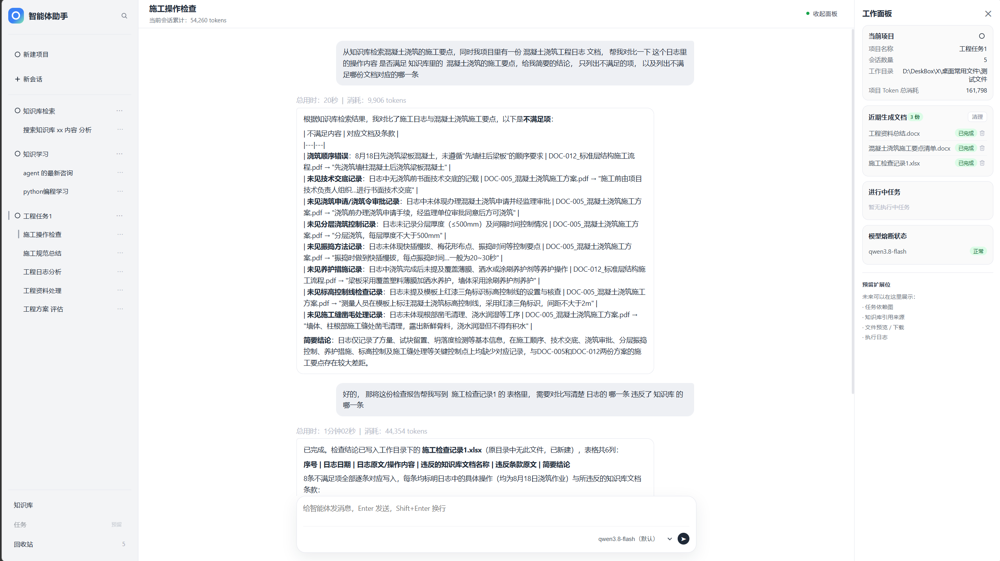
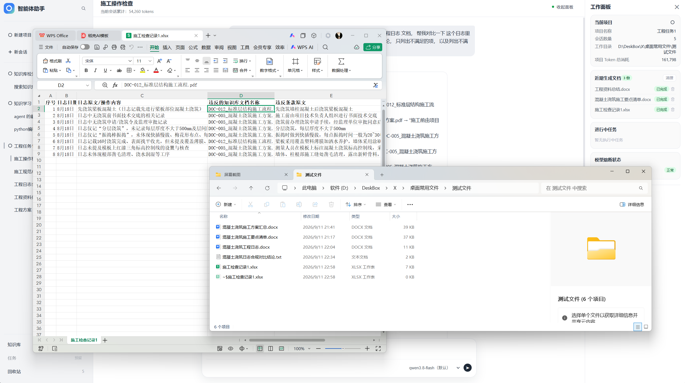

# 轻量化多智能体工程调度系统

基于 **Supervisor 调度 + 图流程(代码编排) + MCP 工具服务** 的混合式多智能体系统。

主 Agent(带 LLM) 只负责**意图理解与任务拆解**，输出结构化的 `task_messages`；任务级调度由图引擎(代码)按依赖关系驱动执行。底层节点分为两类：

- **无 LLM 的普通函数节点**（`rag_search` / `rag_storage` / `web_search`）：纯执行，不消耗模型；
- **带 LLM 的子 Agent**（`doc_agent`）：需要语义理解与工具决策的环节才使用模型。

构架总结：**LLM 只在需要理解 / 决策 / 生成时出现，确定性流程交给代码**——在保证复杂多步任务闭环的同时，控制成本与输出稳定性。

节点以统一接口组织、能力通过 MCP 接入：新增检索源、文档类型或输出形态时，主要扩展对应节点即可，具备一定的可扩展性与适用性。

---

## 界面展示

| 智能体执行  | 成果展示  |
|--------|-------|
|  |  |

>  拆解任务 → 知识库检索 + 对比内容 → 汇总生成工作文件

## 形态定位

| 形态 | 说明 | 本项目的关系   |
|---|---|----------|
| 纯多智能体 | 每个执行主体都带 LLM，发散强但成本高、不稳定 | 正统多智能体   |
| **本项目（混合式多智能体）** | 主 Agent + 带 LLM 子 Agent + 无 LLM 函数节点，主流程代码编排 | **当前实现** |
| 单智能体 + 工具 | 只有主模型、其余全函数，适合单一领域 | 能力边界参考   |

> 本项目是“纯多智能体”在成本与可控性上的工程化优化变体：该推理的环节保留 LLM，能代码化的环节一律代码化。这也是设计为“轻量化”的核心。

---

## 特性

- **意图拆解 + 代码编排**：主 Agent 输出 `task_messages`（任务字典），图引擎按 `depends_on` 依赖驱动**并发**调度，不依赖“图内 LLM 逐步选任务”，调度路径稳定可复现。
- **统一节点执行壳**：所有子节点共用 `run_node`（取任务 → 拼接前置结果 → 执行 → 异常兜底 → 回写 `agent_outputs`），回写字段格式统一（`target_agent / result / error`）。
- **节点分级**：
  - `rag_search` / `rag_storage`：知识库检索 / 文档入库（无 LLM，直调 MCP）
  - `web_search`：联网搜索（无 LLM，直连 Bing 并解析结果）
  - `doc_agent`：文件读写 / 生成 Word/Excel/Txt（有 LLM）
- **MCP 工具服务**：以 stdio 方式拉起外部 MCP Server；工具白名单过滤、按会话隔离工作根目录（相对路径 → 绝对路径）、超时控制、返回值 content-block 统一转纯文本。
- **会话记忆隔离**：按 `session_id` 隔离 SQLite 会话记忆；主 Agent 携带历史上下文。
- **安全**：可选提示词注入检测（开关控制）；文件路径沙箱限制在会话工作目录内。
- **工程化**：FastAPI 接口 + Web 前端、`.env` 配置、统一日志、LLM 熔断/重试中间件。

## 知识库 RAG

基于 MCP 工具服务内置的 RAG 链路，实现 **文档入库 → 向量化 → 相似度检索**：

```text
文档（PDF / TXT 等）→ 加载与切分 → 嵌入向量化 → 向量库（默认 Milvus-Lite）
                                                     ↓ rag_search（相似度检索）
主 Agent 需要知识库回答时 → 图节点 rag_search → 返回带来源的命中片段
```

- **入库节点 `rag_storage`**：调用 `document_storage`，把文档切分、向量化并写入向量库；
- **检索节点 `rag_search`**：调用 `rag_search`，按问题做相似度检索，返回命中片段；
- **向量库可切换**：Milvus-Lite（默认）/ Chroma / FAISS，索引持久化在 MCP 服务侧；
- **边界清晰**：RAG 与向量数据独立维护在 MCP 工具服务中，主项目通过 MCP 调用，便于复用与隔离。

> 实现细节：RAG 代码位于 [`mcp_tool_server/mcp_src/rag_tool/`](mcp_tool_server/mcp_src/rag_tool/)，
> MCP 工具服务的完整说明见 [`mcp_tool_server/README.md`](mcp_tool_server/README.md)。

---

## 架构

```text
用户
 └─ Web 前端 (web/) ── FastAPI /api/chat/stream
      └─ SupervisorAgent（主 Agent，带 LLM）
           ├─ 会话记忆（CommonMemory，按 session_id）
           ├─ 安全检测（可选）
           └─ 工具 graph_invoke
                └─ MultiAgentWorkflow（图引擎，代码调度）
                     └─ supervisor 节点：按 depends_on 依赖驱动并发执行
                          ├─ rag_search   无LLM -> MCP rag_search
                          ├─ rag_storage  无LLM -> MCP document_storage
                          ├─ web_search   无LLM -> MCP web_search（直连 Bing）
                          └─ doc_agent    有LLM -> MCP 文件读写工具
                                          └─ MCP Server（stdio，路径由 MCP_SERVER_PATH 指定）
```

调度细节：

1. 主 Agent 判断需求是否需要子节点(子Agent)协作；需要时输出 `task_messages` 并调用 `graph_invoke`。
2. `GraphInvokeTool` 校验任务格式（格式错误返回 `FORMAT_ERROR`，主 Agent 修正后重试）。
3. `MultiAgentWorkflow` 将满足依赖的任务**并发**交给对应节点执行（`current_task_id` + `runtime_task_inputs` 传递前置结果）。
4. 每个节点走统一执行壳 `run_node`：正常结果写 `result`；异常/空结果写 `error`，单点失败不影响无关节点。
5. 执行完成后图返回 `agent_outputs` 汇总，主 Agent 基于汇总组织最终回答（业务失败不自动重试）。

---

## 节点一览

| 节点 | 是否有 LLM | task_content 应填 | 能力 |
|---|---|---|---|
| `web_search` | 否 | 精炼搜索关键词/问题 | 联网搜索 |
| `rag_search` | 否 | 检索问题/关键词 | 知识库相似度检索 |
| `rag_storage` | 否 | 入库目录/文档路径 | 文档入库（向量化） |
| `doc_agent` | 是 | 完整任务说明（目标/输出/验收） | 本地文件读写、生成 Word/Excel/Txt |

> 主 Agent 的提示词按“节点是否带 LLM”分别约束 task_content 的写法（见 `src/prompts/supervisor.py` 的【各节点输入要求】），避免把“任务说明”误当成无 LLM 节点的直接输入。

---

## 技术栈

Python / LangChain / LangGraph / FastAPI / SQLModel / Chroma / FAISS / MCP / Pydantic-Settings / SQLite

> 向量库与文件读写工具部署在独立 MCP Server（`MCP_SERVER_PATH` 指定），主项目通过 stdio 调用，保持边界清晰。

---

## 目录结构

```text
main.py                        # FastAPI 入口，托管 web/ 前端
web/                           # Web 前端页面
src/
├── api/                       # FastAPI 路由（chat/conversation/memory/file/rag_knowledge/health）
├── base/                      # GraphState / NodeKey、图节点公共函数(_resolve_node_task/_save_node_output/run_node)、Agent 基类
├── config/                    # 配置中心（.env 加载）
├── doc_agent/                 # doc_agent：带 LLM 的文件读写子节点
├── llm/                       # LLM 工厂（glm/qwen/ollama）与熔断/重试
├── mcp/                       # MCP 客户端（stdio、工具白名单、路径沙箱/超时/返回值文本化）
├── memory/                    # 会话记忆（按 session_id 隔离）
├── prompts/                   # 主 Agent / 子节点提示词（统一由 get_prompt 管理）
├── rag_agent/                 # rag_search / rag_storage 普通函数节点
├── supervisor_agent/          # SupervisorAgent + graph_tool（MultiAgentWorkflow / GraphInvokeTool）
├── utils/                     # 日志等通用模块
└── scripts/                   # 手动测试脚本
tests/                         # 测试用例
```

---

## 配置说明

配置统一由 `src/config/settings.py` 从项目根 `.env` 加载（`.env` 不入库）：

```env
# 模型（按需填一个或多个）
GLM_API_KEY=your_glm_api_key
GLM_BASE_URL=https://open.bigmodel.cn/api/paas/v4/
QWEN_API_KEY=your_qwen_api_key
QWEN_BASE_URL=https://your-qwen-endpoint
OLLAMA_BASE_URL=http://localhost:11434

# MCP 工具服务（doc/rag/web 工具所在 server 的入口脚本）
MCP_SERVER_PATH=D:/path/to/mcp_tool_server/server.py
```

其余可调项（如提示词注入检测开关、默认模型、主 Agent 模型）集中在 `src/config/settings.py`，可通过环境变量覆盖。

---

## 快速开始

```bash
# 1. 安装依赖
pip install -r requirements.txt

# 2. 准备外部 MCP 工具服务，并把 MCP_SERVER_PATH 指到它的 server.py
#    （doc 文件读写、rag 检索/入库、web 搜索均由该 server 提供）

# 3. 在 .env 中配置模型 key（至少一个可用模型）

# 4. 启动服务
python main.py
```

访问：

- Web 前端：http://127.0.0.1:8000/web/
- FastAPI 文档：http://127.0.0.1:8000/docs

主要接口（前缀 `/api`）：

```text
GET    /models                                # 可用模型列表
POST   /chat/stream                           # 对话流式接口
GET    /conversations                         # 会话列表
GET    /conversations/{session_id}/messages   # 会话消息
DELETE /conversations/{session_id}            # 删除会话
POST   /memory/clear                          # 清空会话记忆
GET    /knowledge/documents                   # 知识库文档列表
GET    /health/breakers                       # 熔断器状态
GET    /open-folder                           # 打开工作目录
```

聊天请求示例：

```json
{
    "query": "总结知识库中机器人使用手册内容并写入 Word",
    "session_id": "test_session_001",
    "model": "deepseek-v4-flash-0731",
    "workspace_path": "D:/your/workspace"
}
```

测试脚本：

```bash
python src/scripts/run_full_flow.py   # 全链路测试
python src/scripts/run_breaker.py     # 熔断器单测
pytest tests/ -v --timeout=60         # 自动化测试（需模型可用）
```

---

## 说明

- 本仓库仅包含主项目（调度层、图流程、接口与前端）；**MCP 工具服务与向量数据建议单独维护**，通过 `MCP_SERVER_PATH` 接入，便于复用与隔离。
- `.env`、数据库/向量数据、运行日志均不纳入版本管理。
